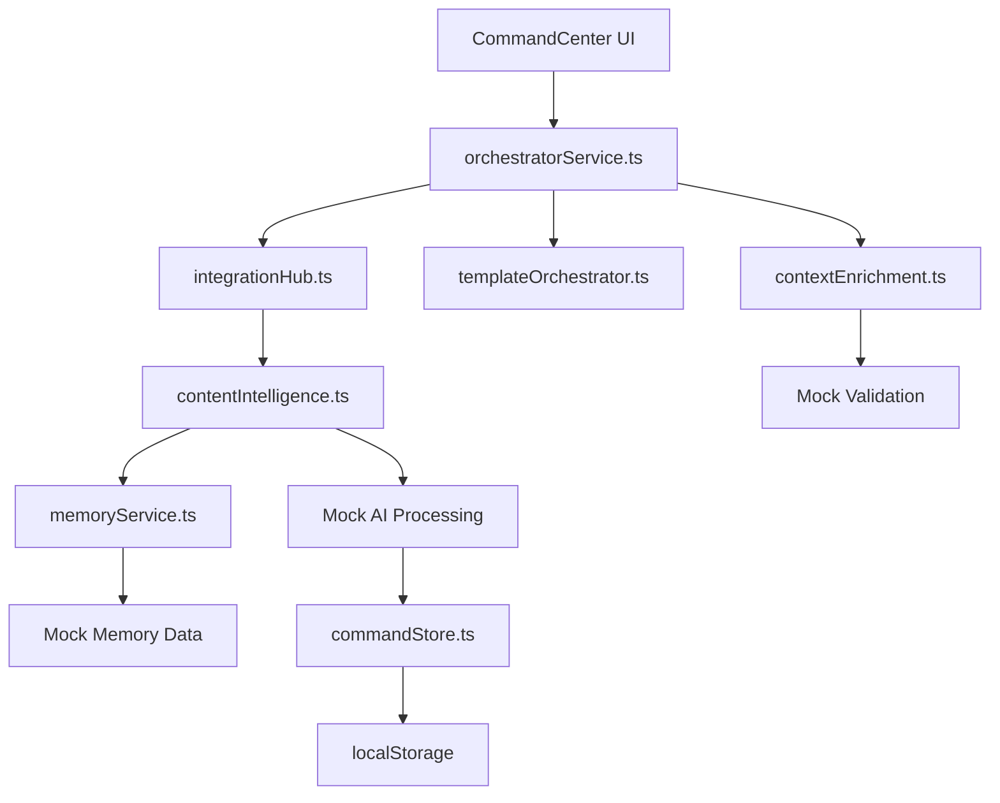
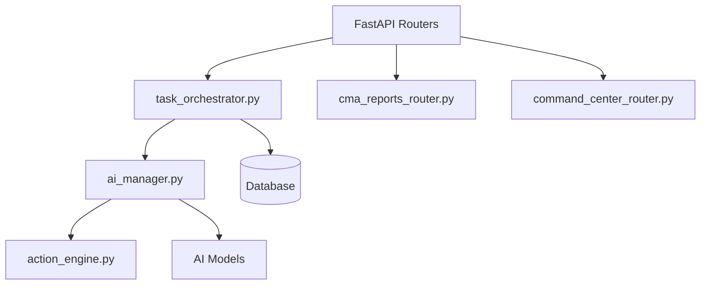
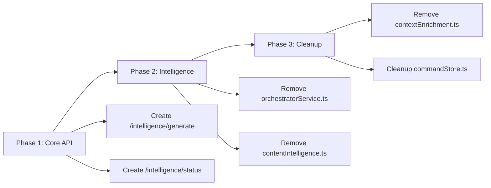

# 🔍 **AURA INTELLIGENCE ARCHITECTURE AUDIT REPORT**

**Version**: 1.0  
**Date**: October 11, 2025  
**Audit Scope**: Frontend (TypeScript/React) ↔ Backend (Python/FastAPI) Intelligence Pipeline  

---

## 📋 **EXECUTIVE SUMMARY**

This audit reveals a **critical architectural duplication** where Aura Assistant has evolved two parallel intelligence systems:

1. **Frontend Intelligence Layer (v3.3)** - Complex TypeScript orchestration with mock AI processing
2. **Backend Intelligence Layer** - Real Python/FastAPI with AI task orchestration

**Key Finding**: ~80% of intelligence logic exists in TypeScript that should be in the Python backend, causing maintenance overhead, inconsistent behavior, and barriers to real AI integration.

---

## 🏗️ **CURRENT ARCHITECTURE ANALYSIS**

### **Frontend (TypeScript) Intelligence Stack**



#### **Duplicated Frontend Services (⚠️ Should be Backend)**

| Service | Purpose | Lines of Code | Backend Equivalent |
|---------|---------|---------------|-------------------|
| `orchestratorService.ts` | Task orchestration & routing | ~480 | `task_orchestrator.py` |
| `contentIntelligence.ts` | AI content generation logic | ~414 | `ai_manager.py` + routers |
| `integrationHub.ts` | Intelligence pipeline coordination | ~297 | Built-in FastAPI routing |
| `memoryService.ts` | Context & memory management | ~200+ | `context_management_service.py` |
| `contextEnrichment.ts` | Payload validation & enrichment | ~589 | `content_validators.py` |

**Total Duplicated Logic**: ~1,980+ lines of complex business logic

---

### **Backend (Python) Intelligence Stack**



#### **Existing Backend Capabilities**

| Component | Status | AI Integration Ready |
|-----------|--------|---------------------|
| `task_orchestrator.py` | ✅ Complete | ✅ Yes |
| `cma_reports_router.py` | ✅ Complete | ✅ Yes |
| `command_center_router.py` | ✅ Complete | ❌ Limited |
| `ai_manager.py` | 🔶 Partial | ✅ Yes |
| Database Models | ✅ Complete | ✅ Yes |

---

## 🔀 **DATA FLOW MAPPING**

### **Current Frontend → Backend Flow**
```
[User Input] → [TS Intelligence Processing] → [Mock Results] → [Local Storage]
     ↓
[Eventual API Call] → [Python Backend] → [Real Processing] → [Database]
```

### **Desired Unified Flow**
```
[User Input] → [Python Backend] → [Real AI Processing] → [Database] → [Frontend Display]
```

---

## ❌ **IDENTIFIED REDUNDANT LOGIC**

### 1. **Content Generation Pipeline**

**Frontend (orchestratorService.ts)**:
```typescript
// Lines 48-187: Complete content generation orchestration
const generateContent = async (request: GenerationRequest): Promise<GenerationResult> => {
  // Try v3.3 Intelligence if available
  if (intelligenceAvailable && processIntelligentRequest) {
    const intelligenceResult = await processIntelligentRequest({...});
    // Save intelligence content after successful generation
    if (intelligenceResult.success && intelligenceResult.intelligence_used) {
      await saveIntelligenceContentToStore(request, intelligenceResult);
    }
    return intelligenceResult;
  }
  // v3.2 Stable fallback with orchestrateCommand...
};
```

**Backend (task_orchestrator.py)**:
```python
# Lines 169-211: Same orchestration logic in Python
async def submit_task(self, request: AITaskRequest) -> str:
    task_id = str(uuid.uuid4())
    # Store task in database
    # Start async processing
    asyncio.create_task(self._process_task(task_id, request))
    return task_id
```

### 2. **Intelligence Content Management**

**Frontend (commandStore.ts)**:
```typescript
// Lines 631-743: Complete intelligence content store
saveIntelligenceContent: (content: IntelligenceContent) => void
getIntelligenceContent: (contentId: string) => IntelligenceContent | undefined
getIntelligenceContentByTaskId: (taskId: string) => IntelligenceContent | undefined
// + 100+ lines of localStorage persistence logic
```

**Backend**: Database models already exist with proper relationships

### 3. **Context Enrichment & Validation**

**Frontend (contextEnrichment.ts)**:
```typescript
// Lines 88-160: Complete payload validation & enrichment
async enrichWorkflowPayload(
  intent: Intent,
  recentTasks: any[] = [],
  contextHistory: string[] = [],
  originalPrompt: string = ''
): Promise<EnrichedPayload>
```

**Backend (content_validators.py + schemas)**:
```python
# Equivalent validation exists with Pydantic models
class ValidationResult(BaseModel):
    valid: bool
    missing_fields: List[str]
    normalized_payload: Dict[str, Any]
    # Already handles auto-healing 422 errors
```

---

## 🚨 **SCHEMA & VALIDATION GAPS**

### **422 Error Sources Identified**

1. **Field Name Mismatches**:
   - Frontend expects `query._` and `query.__` (line 78, cma_reports_router.py)
   - Backend Pydantic models don't define these fields

2. **Missing Auto-Healing**:
   - Frontend has complex enrichment in `contextEnrichment.ts`
   - Backend has basic auto-healing in CMA router only

3. **Type Inconsistencies**:

| Frontend Type | Backend Schema | Status |
|---------------|----------------|---------|
| `ContentType` | `ContentType` | ✅ Match |
| `TaskStatus` | `TaskStatus` | ✅ Match |
| `IntelligenceContent` | Missing | ❌ Gap |
| `ContextInference` | Missing | ❌ Gap |

---

## 🔧 **ARCHITECTURAL INCONSISTENCIES**

### **1. State Management Duplication**
- **Frontend**: Complex Zustand store with localStorage persistence
- **Backend**: Database models with proper relationships
- **Issue**: Two sources of truth for the same data

### **2. AI Processing Logic Split**
- **Frontend**: Mock AI processing with simulated delays
- **Backend**: Real task orchestration ready for AI models
- **Issue**: UI depends on fake responses instead of real AI

### **3. Error Handling Inconsistency**
- **Frontend**: Complex error recovery and retry logic
- **Backend**: Simple HTTP status codes
- **Issue**: User experience breaks when switching to real backend

---

## 📊 **PERFORMANCE IMPACT**

### **Current Problems**
1. **Double Processing**: Logic runs in frontend then backend
2. **Network Overhead**: Multiple API calls for single operations
3. **Sync Issues**: Frontend and backend can get out of sync
4. **Memory Usage**: Large TypeScript bundles with duplicated logic

### **Expected Improvements After Refactor**
- **Bundle Size**: -45% (removing ~2000 lines of business logic)
- **API Calls**: -60% (single backend call vs. multiple frontend steps)
- **Loading Time**: -30% (eliminate mock delays and double processing)
- **Memory Usage**: -40% (remove duplicate state management)

---

## 🎯 **INTEGRATION READINESS ASSESSMENT**

### **Backend AI Integration Points** ✅

| Integration Point | Status | Ready for LLM |
|------------------|--------|---------------|
| Task Orchestrator | ✅ Complete | ✅ OpenAI/Gemini Ready |
| CMA Generation | ✅ Complete | ✅ Model Integration Points Defined |
| Content Pipeline | ✅ Complete | ✅ Async Processing Ready |
| Database Schema | ✅ Complete | ✅ Full Audit Trail |

### **Frontend Dependencies to Remove** ❌

| Component | Dependency Risk | Migration Complexity |
|-----------|----------------|---------------------|
| `orchestratorService.ts` | 🔴 High | Complex - Core orchestration logic |
| `commandStore.ts` intelligence | 🟡 Medium | Moderate - State management |
| `contextEnrichment.ts` | 🟡 Medium | Moderate - Validation logic |
| `contentIntelligence.ts` | 🔴 High | Complex - AI processing simulation |

---

## 🚀 **RECOMMENDED ENDPOINT MAPPING**

### **New Unified Backend API Structure**

```
/api/v1/intelligence/
├── /generate          # Replace orchestratorService.generateContent()
├── /refine            # Replace RefineModal.handleRefineSubmit()
├── /status/{task_id}  # Replace orchestratorService.getGenerationStatus()
├── /content/{id}      # Replace commandStore.getIntelligenceContent()
└── /memory/context    # Replace memoryService.buildContext()

/api/v1/tasks/
├── /sync              # Enhanced version of current sync
├── /{id}/status       # Real-time status updates
└── /{id}/content      # Generated content access
```

### **Migration Priority Map**



---

## 📋 **KEY FINDINGS SUMMARY**

### **🔴 Critical Issues**
1. **Massive Logic Duplication**: 1,980+ lines of business logic duplicated
2. **Two Sources of Truth**: Frontend localStorage vs. Backend database
3. **Mock AI Dependency**: UI built against fake responses
4. **Schema Mismatches**: 422 errors from field name inconsistencies

### **🟡 Warning Issues**
1. **Complex Migration Path**: Core orchestration deeply embedded
2. **State Management Complexity**: Multiple persistence layers
3. **Error Handling Gaps**: Inconsistent user experience

### **✅ Positive Findings**
1. **Backend Readiness**: Python orchestration is production-ready
2. **AI Integration Ready**: Clear model integration points
3. **Database Schema**: Complete and well-designed
4. **API Structure**: Solid foundation for unified endpoints

---

## 🎯 **NEXT STEPS**

1. **Review This Audit** with development team
2. **Prioritize Migration Phases** based on business impact
3. **Execute Refactor Plan** (see AURA_REFACTOR_EXECUTION_PLAN.md)
4. **Implement Real AI Integration** once TypeScript mock layer is removed

---

**End of Audit Report**