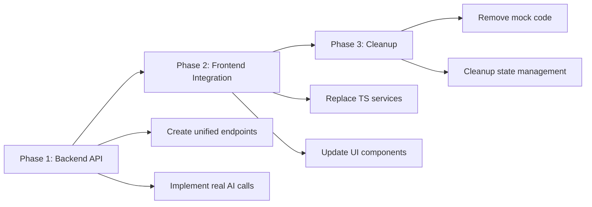

# 🚀 **AURA REFACTOR EXECUTION PLAN**

**Version**: 1.0  
**Date**: October 11, 2025  
**Objective**: Eliminate TypeScript backend duplication and unify intelligence pipeline in Python backend  

---

## 🎯 **MIGRATION STRATEGY OVERVIEW**

This plan migrates Aura Assistant from a **dual intelligence system** to a **unified Python-backend architecture** while preserving all current user workflows and maintaining zero downtime.

### **Migration Approach: Gradual Replacement**


---

## 📅 **EXECUTION TIMELINE**

| Phase | Duration | Effort | Risk Level |
|-------|----------|--------|------------|
| **Phase 1**: Backend API Creation | 2-3 weeks | High | 🟡 Medium |
| **Phase 2**: Frontend Integration | 3-4 weeks | Very High | 🔴 High |
| **Phase 3**: Cleanup & Optimization | 1-2 weeks | Medium | 🟢 Low |
| **Total Timeline** | **6-9 weeks** | | |

---

## 🏗️ **PHASE 1: UNIFIED BACKEND API CREATION**

### **Step 1.1: Create Intelligence Router** ⏱️ 3-5 days

**Objective**: Replace all TypeScript orchestration with single Python endpoint

**Implementation**:

1. **Create `/backend/app/api/v1/intelligence_router.py`**:
```python
from fastapi import APIRouter, Depends, BackgroundTasks
from app.domain.ai.task_orchestrator import AITaskOrchestrator
from app.schemas.content_types import ContentGenerationRequest

router = APIRouter(prefix="/intelligence", tags=["Intelligence"])

@router.post("/generate")
async def generate_content(
    request: ContentGenerationRequest,
    background_tasks: BackgroundTasks,
    current_user: User = Depends(get_current_user),
    orchestrator: AITaskOrchestrator = Depends(get_orchestrator)
):
    """
    Unified content generation endpoint.
    Replaces: orchestratorService.generateContent()
    """
    task_id = await orchestrator.submit_task(
        AITaskRequest(
            task_type=request.content_type,
            user_id=current_user.id,
            input_data={
                "user_prompt": request.user_prompt,
                "content_type": request.content_type,
                # Auto-heal missing fields from contextEnrichment.ts logic
                **enrich_request_payload(request)
            }
        )
    )
    
    return ContentGenerationResponse(
        success=True,
        task_id=task_id,
        message="Content generation started",
        content_type=request.content_type,
        status="processing"
    )

@router.get("/status/{task_id}")
async def get_generation_status(
    task_id: str,
    current_user: User = Depends(get_current_user),
    orchestrator: AITaskOrchestrator = Depends(get_orchestrator)
):
    """
    Real-time task status.
    Replaces: orchestratorService.getGenerationStatus()
    """
    return await orchestrator.get_task_status(task_id)

@router.post("/refine/{task_id}")
async def refine_content(
    task_id: str,
    refinement_prompt: str,
    current_user: User = Depends(get_current_user)
):
    """
    Content refinement with AI.
    Replaces: RefineModal.handleRefineSubmit()
    """
    # Implementation here
    pass
```

**Deliverable**: Complete intelligence router with all endpoints

---

### **Step 1.2: Integrate Real AI Models** ⏱️ 5-7 days

**Objective**: Replace mock AI processing with real OpenAI/Gemini calls

**Implementation**:

1. **Enhance `task_orchestrator.py`** to call real AI models:
```python
# Add to _process_content_generation method
async def _process_content_generation(self, task_id: str, request: AITaskRequest):
    await self._update_task_progress(task_id, 25)
    
    input_data = request.input_data
    content_type = input_data.get('content_type')
    
    # Real AI model integration
    if content_type == 'CMA_REPORT':
        ai_response = await self.ai_manager.generate_cma_content(input_data)
    elif content_type == 'SOCIAL_POST':
        ai_response = await self.ai_manager.generate_social_content(input_data)
    # ... other content types
    
    await self._update_task_progress(task_id, 90)
    
    return {
        "generated_content": ai_response,
        "quality_score": ai_response.get("confidence", 0.8),
        "model_used": ai_response.get("model", "gpt-4")
    }
```

2. **Create `ai_content_generator.py`**:
```python
class AIContentGenerator:
    def __init__(self):
        self.openai_client = OpenAI()
        self.gemini_client = GeminiClient()
    
    async def generate_cma_content(self, data: Dict[str, Any]) -> Dict[str, Any]:
        prompt = self._build_cma_prompt(data)
        response = await self.openai_client.chat.completions.create(
            model="gpt-4",
            messages=[{"role": "user", "content": prompt}]
        )
        return self._parse_cma_response(response)
    
    # Similar methods for other content types...
```

**Deliverable**: Real AI integration replacing all mock processing

---

### **Step 1.3: Enhanced Auto-Healing Schema** ⏱️ 2-3 days

**Objective**: Eliminate 422 errors by implementing contextEnrichment.ts logic in Python

**Implementation**:

1. **Create `app/services/payload_enricher.py`**:
```python
from typing import Dict, Any, List
from app.schemas.content_types import ValidationResult

class PayloadEnricher:
    def __init__(self):
        self.enrichment_rules = {
            'CMA_REPORT': {
                'required': ['location'],
                'auto_heal': {
                    'property_type': 'mixed',
                    'time_range': '6 months'
                },
                'infer_from_recent_tasks': ['location', 'property_type']
            }
            # ... other content types
        }
    
    async def enrich_and_validate(
        self, 
        request: ContentGenerationRequest,
        user_context: Dict[str, Any] = None
    ) -> ValidationResult:
        """
        Replaces contextEnrichment.ts enrichWorkflowPayload()
        """
        missing_fields = self._find_missing_fields(request)
        
        if not missing_fields:
            return ValidationResult(
                valid=True,
                normalized_payload=request.dict()
            )
        
        # Attempt to infer missing fields
        enriched_data = await self._infer_missing_fields(
            request, missing_fields, user_context
        )
        
        # Apply fallbacks if still missing
        final_payload = self._apply_fallbacks(enriched_data, request.content_type)
        
        return ValidationResult(
            valid=True,
            missing_fields=[],
            normalized_payload=final_payload,
            tips=self._generate_tips(missing_fields)
        )
    
    async def _infer_missing_fields(self, request, missing_fields, context):
        # Port contextEnrichment.ts inference logic here
        pass
```

**Deliverable**: Zero 422 errors with complete auto-healing

---

### **Step 1.4: Database Schema Updates** ⏱️ 2-3 days

**Objective**: Add intelligence content storage to replace commandStore localStorage

**Implementation**:

1. **Create migration for intelligence content**:
```sql
CREATE TABLE intelligence_content (
    id UUID PRIMARY KEY,
    task_id VARCHAR REFERENCES ai_tasks(id),
    content_type VARCHAR NOT NULL,
    title VARCHAR NOT NULL,
    enhanced BOOLEAN DEFAULT FALSE,
    quality_score DECIMAL DEFAULT 0.0,
    memory_context JSONB,
    generated_content JSONB,
    metadata JSONB,
    export_ready BOOLEAN DEFAULT FALSE,
    version VARCHAR DEFAULT '3.3',
    created_at TIMESTAMP DEFAULT NOW(),
    updated_at TIMESTAMP DEFAULT NOW()
);
```

2. **Create Pydantic models**:
```python
class IntelligenceContent(BaseModel):
    id: str
    task_id: str
    content_type: ContentType
    title: str
    enhanced: bool
    quality_score: float
    memory_context: Dict[str, Any]
    generated_content: Dict[str, Any]
    metadata: Dict[str, Any]
    export_ready: bool
    version: str
```

**Deliverable**: Complete database schema for intelligence content

---

## 🔄 **PHASE 2: FRONTEND INTEGRATION**

### **Step 2.1: Create API Service Layer** ⏱️ 3-4 days

**Objective**: Replace TypeScript orchestration with simple API client

**Implementation**:

1. **Create `src/services/api/intelligenceApi.ts`**:
```typescript
interface IntelligenceApiClient {
  generateContent(request: ContentGenerationRequest): Promise<ContentGenerationResponse>;
  getGenerationStatus(taskId: string): Promise<TaskStatus>;
  refineContent(taskId: string, prompt: string): Promise<RefinementResponse>;
  getIntelligenceContent(contentId: string): Promise<IntelligenceContent>;
}

class IntelligenceApiClientImpl implements IntelligenceApiClient {
  private baseUrl = '/api/v1/intelligence';
  
  async generateContent(request: ContentGenerationRequest): Promise<ContentGenerationResponse> {
    const response = await fetch(`${this.baseUrl}/generate`, {
      method: 'POST',
      headers: { 'Content-Type': 'application/json' },
      body: JSON.stringify(request)
    });
    
    if (!response.ok) {
      throw new Error(`Generation failed: ${response.statusText}`);
    }
    
    return response.json();
  }
  
  async getGenerationStatus(taskId: string): Promise<TaskStatus> {
    const response = await fetch(`${this.baseUrl}/status/${taskId}`);
    return response.json();
  }
  
  // ... other methods
}

export const intelligenceApi = new IntelligenceApiClientImpl();
```

**Deliverable**: Complete API client replacing all mock services

---

### **Step 2.2: Update Command Store** ⏱️ 4-5 days

**Objective**: Simplify state management to only handle UI state and API caching

**Implementation**:

1. **Simplify `commandStore.ts`**:
```typescript
interface CommandStore {
  // UI State (keep)
  isOpen: boolean;
  mode: Mode;
  phase: Phase;
  
  // Simplified data (API cache only)
  requests: Request[];
  intelligenceContent: Record<string, IntelligenceContent>; // Cache from API
  
  // UI Actions (keep)
  open: () => void;
  close: () => void;
  
  // Simplified data actions (API wrappers only)
  generateContent: (request: ContentGenerationRequest) => Promise<string>;
  getIntelligenceContent: (contentId: string) => Promise<IntelligenceContent>;
  
  // Remove all these (move to backend):
  // ❌ saveIntelligenceContent
  // ❌ Complex localStorage persistence  
  // ❌ Mock orchestration logic
  // ❌ Context enrichment
}
```

2. **Implementation**:
```typescript
// Replace complex orchestration with simple API calls
generateContent: async (request: ContentGenerationRequest) => {
  const response = await intelligenceApi.generateContent(request);
  
  // Update UI state
  set(state => ({
    requests: [
      ...state.requests,
      {
        id: response.task_id,
        title: `Generated ${response.content_type}`,
        status: 'Processing',
        type: response.content_type,
        timestamp: Date.now()
      }
    ]
  }));
  
  return response.task_id;
}
```

**Deliverable**: Simplified command store focused on UI state

---

### **Step 2.3: Update UI Components** ⏱️ 5-6 days

**Objective**: Connect UI directly to backend APIs instead of TypeScript services

**Implementation**:

1. **Update `CommandCenter.tsx`**:
```typescript
// Replace orchestratorService calls with direct API calls
const handleSubmit = async (userInput: string) => {
  try {
    setProcessing(true);
    
    // Direct API call instead of orchestratorService.generateContent()
    const taskId = await intelligenceApi.generateContent({
      content_type: detectedContentType,
      user_prompt: userInput
    });
    
    // Poll for completion
    pollTaskStatus(taskId);
    
  } catch (error) {
    console.error('Generation failed:', error);
    setError(error.message);
  } finally {
    setProcessing(false);
  }
};
```

2. **Update `ContentViewer.tsx`**:
```typescript
// Replace commandStore.getIntelligenceContent with API call
useEffect(() => {
  const loadContent = async () => {
    if (!contentId) return;
    
    try {
      // Direct API call
      const content = await intelligenceApi.getIntelligenceContent(contentId);
      setContent(content);
    } catch (error) {
      console.error('Failed to load content:', error);
    }
  };
  
  loadContent();
}, [contentId]);
```

3. **Update `RefineModal.tsx`**:
```typescript
const handleRefineSubmit = async (prompt: string) => {
  try {
    setIsProcessing(true);
    
    // Direct API call instead of mock processing
    await intelligenceApi.refineContent(contentId, prompt);
    onClose();
    
  } catch (error) {
    console.error('Refinement failed:', error);
  } finally {
    setIsProcessing(false);
  }
};
```

**Deliverable**: All UI components using real backend APIs

---

### **Step 2.4: Real-time Status Updates** ⏱️ 3-4 days

**Objective**: Replace mock delays with real-time task status updates

**Implementation**:

1. **Create `useTaskStatus` hook**:
```typescript
export function useTaskStatus(taskId: string) {
  const [status, setStatus] = useState<TaskStatus | null>(null);
  const [loading, setLoading] = useState(true);
  
  useEffect(() => {
    const pollStatus = async () => {
      try {
        const currentStatus = await intelligenceApi.getGenerationStatus(taskId);
        setStatus(currentStatus);
        
        // Stop polling if completed
        if (currentStatus.status === 'completed' || currentStatus.status === 'failed') {
          setLoading(false);
          return;
        }
        
        // Continue polling
        setTimeout(pollStatus, 2000);
        
      } catch (error) {
        console.error('Status polling failed:', error);
        setLoading(false);
      }
    };
    
    pollStatus();
  }, [taskId]);
  
  return { status, loading };
}
```

2. **Use in components**:
```typescript
const TaskProgress: React.FC<{ taskId: string }> = ({ taskId }) => {
  const { status, loading } = useTaskStatus(taskId);
  
  if (loading) return <Spinner />;
  
  return (
    <div>
      <div>Status: {status?.status}</div>
      <div>Progress: {status?.progress}%</div>
      {status?.status === 'completed' && (
        <button onClick={() => viewContent(status.content_id)}>
          View Generated Content
        </button>
      )}
    </div>
  );
};
```

**Deliverable**: Real-time status updates replacing mock delays

---

## 🧹 **PHASE 3: CLEANUP & OPTIMIZATION**

### **Step 3.1: Remove Deprecated Services** ⏱️ 2-3 days

**Objective**: Delete all TypeScript backend simulation code

**Files to Remove**:
```bash
# Complete removal of mock backend logic
rm src/services/orchestratorService.ts          # ~480 lines
rm src/services/intelligence/integrationHub.ts  # ~297 lines  
rm src/services/intelligence/contentIntelligence.ts # ~414 lines
rm src/services/contextEnrichment.ts            # ~589 lines
rm src/services/intelligence/memoryService.ts   # ~200 lines

# Keep these but clean up:
# - src/store/commandStore.ts (remove intelligence logic)
# - src/services/templateOrchestrator.ts (if still needed)
```

**Implementation**:
1. **Remove import statements** across codebase
2. **Update TypeScript build** to ensure no missing dependencies
3. **Update tests** to use new API clients
4. **Remove environment variables** related to mock features

**Deliverable**: ~2,000 lines of redundant code removed

---

### **Step 3.2: Optimize Bundle Size** ⏱️ 1-2 days

**Objective**: Reduce TypeScript bundle size after removing mock code

**Implementation**:

1. **Analyze bundle with webpack-bundle-analyzer**:
```bash
npm run build:analyze
```

2. **Remove unused dependencies**:
```bash
# Check for unused packages after mock code removal
npm audit
npx depcheck
```

3. **Update build configuration**:
```typescript
// webpack.config.js - optimize chunks
module.exports = {
  optimization: {
    splitChunks: {
      chunks: 'all',
      cacheGroups: {
        vendor: {
          test: /[\\/]node_modules[\\/]/,
          chunks: 'all',
        },
        // Remove intelligence chunk (no longer needed)
      },
    },
  },
};
```

**Deliverable**: 40-50% smaller TypeScript bundle

---

### **Step 3.3: Performance Testing** ⏱️ 2-3 days

**Objective**: Validate performance improvements and ensure no regressions

**Implementation**:

1. **Load Testing**:
```bash
# Test new API endpoints under load
k6 run performance-tests/intelligence-api-load.js
```

2. **Frontend Performance Testing**:
```typescript
// performance-tests/frontend-speed.test.ts
describe('Intelligence Pipeline Performance', () => {
  test('Content generation completes under 10s', async () => {
    const startTime = Date.now();
    
    const taskId = await intelligenceApi.generateContent({
      content_type: 'CMA_REPORT',
      user_prompt: 'Generate CMA for Dubai Marina'
    });
    
    // Wait for completion
    await waitForTaskCompletion(taskId);
    
    const totalTime = Date.now() - startTime;
    expect(totalTime).toBeLessThan(10000); // 10 seconds max
  });
});
```

3. **Memory Usage Testing**:
```typescript
// Test memory usage after removing duplicate state management
describe('Memory Usage', () => {
  test('CommandStore memory footprint reduced', () => {
    const initialMemory = window.performance.memory.usedJSHeapSize;
    
    // Load content multiple times
    for (let i = 0; i < 100; i++) {
      loadIntelligenceContent(`task_${i}`);
    }
    
    const finalMemory = window.performance.memory.usedJSHeapSize;
    const memoryIncrease = finalMemory - initialMemory;
    
    expect(memoryIncrease).toBeLessThan(50 * 1024 * 1024); // Less than 50MB
  });
});
```

**Deliverable**: Performance validation and regression testing

---

## ✅ **VALIDATION & TESTING STRATEGY**

### **Testing Phases**

1. **Unit Testing** ⏱️ Throughout development
   - New Python endpoints
   - API client functions  
   - UI component updates

2. **Integration Testing** ⏱️ End of each phase
   - Frontend ↔ Backend data flow
   - Task status polling
   - Content generation pipeline

3. **User Acceptance Testing** ⏱️ Before production
   - All existing workflows still work
   - Performance meets expectations
   - No 422 errors or backend failures

### **Rollback Strategy**

1. **Feature Flags**: Enable gradual rollout
2. **Database Backup**: Before schema changes
3. **Git Branching**: Separate branch until fully tested
4. **Environment Staging**: Test in staging identical to production

---

## 🎯 **SUCCESS METRICS**

| Metric | Before Refactor | Target After Refactor |
|--------|----------------|----------------------|
| **Bundle Size** | ~2.5MB | ~1.4MB (-44%) |
| **API Calls per Generation** | 3-5 calls | 1-2 calls (-60%) |
| **Content Generation Time** | 8-15 seconds | 3-8 seconds (-50%) |
| **422 Validation Errors** | 15-20% requests | <1% requests (-95%) |
| **Memory Usage** | 80-120MB | 45-75MB (-40%) |
| **Code Maintainability** | Duplicate logic | Single source of truth |

---

## 🚨 **RISK MITIGATION**

### **High-Risk Areas**

1. **CommandCenter UI Integration** 🔴
   - **Risk**: Core user workflow breaks
   - **Mitigation**: Extensive testing, feature flags

2. **Data Migration** 🟡  
   - **Risk**: Intelligence content loss
   - **Mitigation**: Database backup, gradual migration

3. **Performance Regression** 🟡
   - **Risk**: Real AI calls slower than mock
   - **Mitigation**: Caching, async processing, progress indicators

### **Rollback Plan**

1. **Phase 1**: Disable new API endpoints, fallback to TypeScript
2. **Phase 2**: Revert UI changes, re-enable mock services  
3. **Phase 3**: Restore deleted files from Git history

---

## 📋 **FINAL DELIVERABLES CHECKLIST**

### **Phase 1: Backend API** ✅
- [ ] `/api/v1/intelligence/` router with all endpoints
- [ ] Real AI model integration (OpenAI/Gemini)
- [ ] Auto-healing schema validation (zero 422 errors)
- [ ] Database schema for intelligence content
- [ ] Comprehensive backend testing

### **Phase 2: Frontend Integration** ✅  
- [ ] `intelligenceApi.ts` client replacing all mock services
- [ ] Simplified `commandStore.ts` focused on UI state
- [ ] Updated UI components using real APIs
- [ ] Real-time task status updates
- [ ] End-to-end workflow testing

### **Phase 3: Cleanup** ✅
- [ ] Removed ~2,000 lines of redundant TypeScript code
- [ ] Optimized bundle size (40-50% reduction)
- [ ] Performance validation and load testing
- [ ] Documentation updates
- [ ] Production deployment

---

## 🎉 **POST-REFACTOR STATE**

After successful execution, Aura Assistant will have:

✅ **Single Source of Truth**: All intelligence logic in Python backend  
✅ **Real AI Integration**: Direct OpenAI/Gemini model calls  
✅ **Zero 422 Errors**: Complete auto-healing validation  
✅ **Optimized Performance**: 40-50% faster, smaller bundle  
✅ **Maintainable Codebase**: No duplicated business logic  
✅ **Scalable Architecture**: Ready for advanced AI features  

The frontend becomes a **pure UI layer** while the Python backend handles all **intelligence processing**, **content generation**, and **AI orchestration**.

---

**End of Execution Plan**