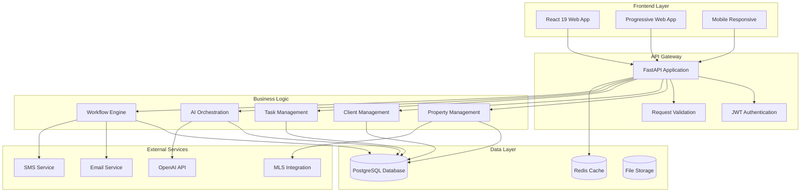

# Aura Real Estate Assistant - System Architecture

## Overview

Aura is designed as a modern, scalable real estate management platform with a clear separation between frontend presentation and backend business logic. The architecture follows microservices principles while maintaining simplicity for development and deployment.

## High-Level Architecture



## Component Breakdown

### Frontend Layer (To Be Built)

**React 19 Web Application**
- Modern React with concurrent features
- Vite for fast development and building
- Tailwind CSS for utility-first styling
- Zustand for lightweight state management
- React Query for server state management

**Key Features:**
- Server-side rendering capabilities
- Progressive Web App features
- Responsive design for all devices
- Real-time updates via WebSocket/SSE
- Offline-first architecture

### Backend Layer (Production Ready)

**FastAPI Application Server**
- Async/await for high performance
- Automatic OpenAPI documentation
- Built-in validation with Pydantic
- JWT-based authentication
- CORS support for cross-origin requests

**Business Services:**
- **Property Management**: CRUD operations, search, filtering
- **Client Management**: Contact management, communication history
- **Task Management**: Workflow automation, scheduling
- **AI Orchestration**: Content generation, data analysis
- **Workflow Engine**: Multi-step business processes

### Data Layer

**PostgreSQL Database**
- Primary data store for all business entities
- ACID compliance for data integrity
- Full-text search capabilities
- Spatial data support for property locations

**Redis Cache**
- Session storage
- API response caching
- Real-time data for dashboards
- Task queue for background jobs

**File Storage**
- Property images and documents
- Generated content and reports
- User uploads and attachments

## Data Models

### Core Entities

```python
# Property Model
class Property:
    id: UUID
    title: str
    description: str
    property_type: PropertyType
    price: Decimal
    location: Dict
    status: PropertyStatus
    created_at: datetime
    updated_at: datetime

# Client Model  
class Client:
    id: UUID
    name: str
    email: str
    phone: str
    client_type: ClientType
    properties: List[Property]
    interactions: List[Interaction]

# Task Model
class Task:
    id: UUID
    title: str
    description: str
    task_type: TaskType
    status: TaskStatus
    assigned_to: UUID
    due_date: datetime
    priority: Priority

# AI Request Model
class AIRequest:
    id: UUID
    request_type: AIRequestType
    content: str
    status: ProcessingStatus
    result: Dict
    workflow_id: UUID
```

## Security Architecture

### Authentication & Authorization

- **JWT Tokens**: Stateless authentication with refresh tokens
- **Role-Based Access Control**: Admin, Agent, Client roles
- **API Key Authentication**: For external service integrations
- **Rate Limiting**: Prevent abuse and ensure fair usage

### Data Protection

- **Encryption at Rest**: Database and file storage encryption
- **Encryption in Transit**: TLS/SSL for all communications
- **Input Validation**: Comprehensive request validation
- **SQL Injection Prevention**: ORM-based queries only

## API Design

### REST Endpoints

```
# Authentication
POST /api/v1/auth/login
POST /api/v1/auth/refresh
POST /api/v1/auth/logout

# Properties
GET    /api/v1/properties
POST   /api/v1/properties
GET    /api/v1/properties/{id}
PUT    /api/v1/properties/{id}
DELETE /api/v1/properties/{id}

# Clients
GET    /api/v1/clients
POST   /api/v1/clients
GET    /api/v1/clients/{id}
PUT    /api/v1/clients/{id}
DELETE /api/v1/clients/{id}

# AI Requests
POST   /api/v1/ai-requests
GET    /api/v1/ai-requests/{id}
GET    /api/v1/ai-requests/{id}/status

# Workflows
POST   /api/v1/workflows/execute
GET    /api/v1/workflows/{id}/status
```

### WebSocket Connections

```
# Real-time updates
ws://localhost:8000/ws/dashboard
ws://localhost:8000/ws/tasks
ws://localhost:8000/ws/ai-requests
```

## Deployment Architecture

### Development Environment

```
├── Backend (Port 8000)
│   ├── FastAPI Server
│   ├── PostgreSQL (Docker)
│   └── Redis (Docker)
└── Frontend (Port 5173)
    └── Vite Dev Server
```

### Production Environment

```
┌─────────────────┐
│   Load Balancer │
└─────────────────┘
         │
    ┌────▼────┐
    │ Nginx   │
    │ Reverse │  
    │ Proxy   │
    └────┬────┘
         │
┌────────▼────────┐
│   FastAPI App   │
│   (Multiple     │
│   Instances)    │
└────────┬────────┘
         │
┌────────▼────────┐
│   PostgreSQL    │
│   (Primary +    │
│   Read Replica) │
└─────────────────┘
```

## Scalability Considerations

### Horizontal Scaling

- **Stateless API**: Multiple FastAPI instances behind load balancer
- **Database Replication**: Primary-replica setup for read scaling
- **Caching Layer**: Redis for frequently accessed data
- **CDN Integration**: Static asset delivery optimization

### Performance Optimization

- **Database Indexing**: Optimized queries for common operations
- **Connection Pooling**: Efficient database connection management
- **Background Tasks**: Async processing for long-running operations
- **Response Caching**: API response caching for read-heavy endpoints

## Monitoring & Observability

### Logging

- **Structured Logging**: JSON format for easy parsing
- **Request Tracing**: Unique request IDs for debugging
- **Error Tracking**: Comprehensive error logging and alerting

### Metrics

- **Application Metrics**: Response times, error rates, throughput
- **Business Metrics**: Property views, client interactions, AI usage
- **Infrastructure Metrics**: CPU, memory, database performance

### Health Checks

- **Endpoint Monitoring**: `/health` endpoint for system status
- **Database Connectivity**: Connection health verification
- **External Service Status**: Third-party API availability

## Future Enhancements

### Phase 1: Core Platform
- [ ] Complete frontend rebuild with React 19
- [ ] Real-time dashboard implementation
- [ ] Mobile-responsive design
- [ ] Basic AI integrations

### Phase 2: Advanced Features  
- [ ] Multi-tenant architecture
- [ ] Advanced analytics and reporting
- [ ] Mobile app development
- [ ] Third-party integrations (MLS, CRM)

### Phase 3: Enterprise Features
- [ ] Microservices architecture
- [ ] Kubernetes deployment
- [ ] Advanced AI/ML capabilities
- [ ] White-label solutions

---

This architecture provides a solid foundation for building a scalable, maintainable real estate management platform while ensuring excellent developer experience and system reliability.