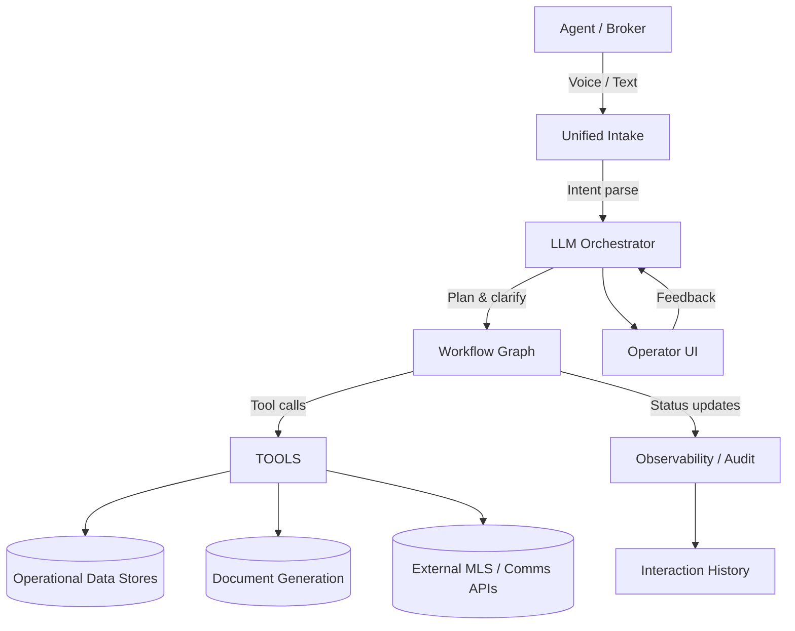
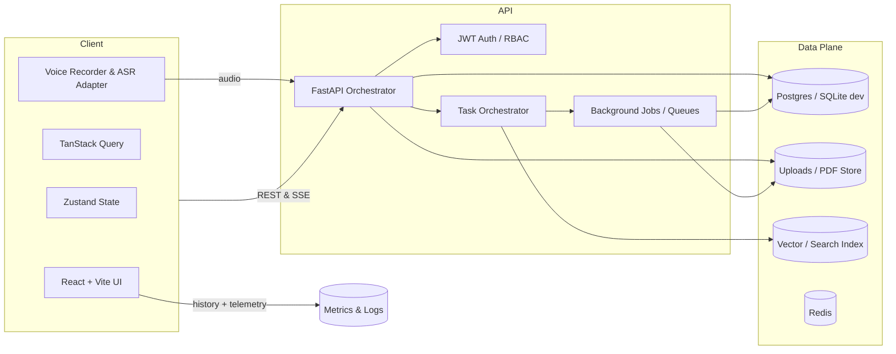

# Target Vision & Architecture

## Capability Map (A–Z)

- **Unified Intake**: ASR transcription + text normalization funnel all requests into a shared schema.
- **LLM Orchestrator**: Gemini (or equivalent) routes intents, fills gaps, and builds deterministic workflow graphs.
- **Execution Layer**: Tool abstractions for CRM reads/writes, vector/RAG retrieval, brochure/CMA rendering, scheduling, and messaging.
- **Governance**: Guardrails, rate limits, trace IDs, and lineage surfaces in UI and logs.

## High-Level System

- **Frontend**: Vite/React client with query caching and real-time updates (SSE) for long-running tasks. Voice pipeline pushes to ASR service before hitting FastAPI.
- **Backend**: FastAPI hosts HTTP + SSE + websocket routes, backed by orchestrator services that queue CMA/brochure/background jobs and persist audit logs.
- **Data Plane**: Postgres holds CRM entities; Redis handles caching/rate limiting; file store serves generated PDFs via signed URLs; vector store optional for RAG.
- **Observability**: Structured logging, metrics, and audit records tied to request IDs allow reconstructing every task end-to-end.

## End-to-End Experience (Text & Voice)

1. **Input**: Agent speaks or types request; voice uses ASR to produce transcript + confidence.
2. **Intent & Planning**: Orchestrator validates entities, asks clarifying questions, builds dependency graph, and allocates tool calls.
3. **Execution**: Tools access CRM (contacts, follow-ups, comps), external MLS, AI content generation, or PDF renders. Long-running jobs stream status via SSE.
4. **Governance**: Guardrails enforce role and scope, redact PII, log every step with request IDs, and capture metrics.
5. **Presentation**: UI shows plan steps, intermediate results, final PDFs/insights, with retry or refinement controls.
6. **Iteration**: User feedback loops back into orchestrator (plan revision, new prompts) and persists preferences/history.

- Voice parity requires offline-safe buffering, partial transcript streaming, and context continuity between voice and subsequent text refinements.
- Document workflows (brochure, CMA) must emit deterministic artifacts, attach to CRM timelines, and expose download/share actions with audit trails.
