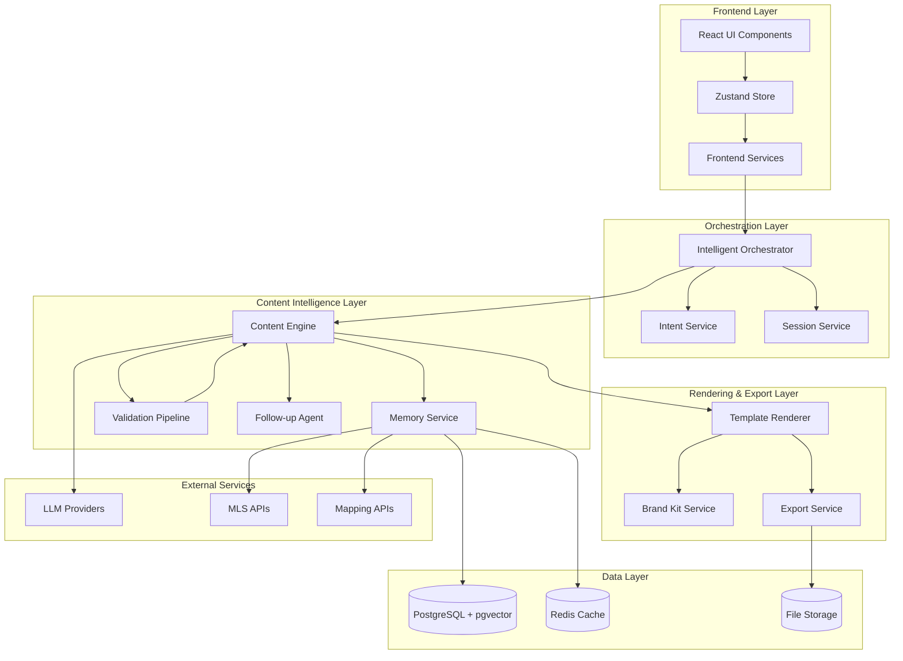

# Aura v3.3 "Intelligent Content Brain" - System Architecture

## Executive Summary

Aura v3.3 introduces the "Intelligent Content Brain" - a sophisticated AI-driven content generation system that transforms simple user inputs into professionally branded, context-aware real estate marketing materials. The system leverages memory-enhanced AI generation, multi-pass validation, template-based rendering, and intelligent follow-up recommendations.

## Core Architecture



## System Components

### 1. Memory Service (`memoryService.ts`)
**Purpose**: Persistent context and entity storage with semantic search capabilities

**Key Features**:
- Agent profiles with preferences and branding
- Property records with market data
- Generated artifacts with quality metadata
- Semantic embedding-based recall
- Context summarization for AI prompts

**Data Models**:
```typescript
interface AgentProfile {
  id: string;
  name: string;
  brokerage: string;
  specialties: string[];
  voice_preferences: VoicePreferences;
  branding: BrandingConfig;
}

interface PropertyRecord {
  id: string;
  address: string;
  details: PropertyDetails;
  market_data: MarketData;
  location: LocationInfo;
}

interface GeneratedArtifact {
  id: string;
  content_type: ContentType;
  content: any;
  metadata: ArtifactMetadata;
  quality_scores: QualityScores;
}
```

**Storage Strategy**:
- PostgreSQL with pgvector for embeddings
- Redis for hot cache and session data
- Semantic embeddings for intelligent recall
- TTL policies for data lifecycle management

### 2. Content Engine (`contentEngine.ts`)
**Purpose**: AI-powered content generation with context awareness and quality validation

**Generation Pipeline**:
1. **Context Building**: Gather relevant memories, brand kit, and template constraints
2. **Prompt Assembly**: Dynamic prompt construction with structured data injection  
3. **Multi-Pass Generation**: Initial draft → self-critique → targeted revision
4. **Quality Validation**: Brand compliance, readability, factual accuracy checks
5. **Template Fitting**: Ensure content fits template slot constraints
6. **Artifact Storage**: Persist results with metadata for future recall

**Quality Scoring**:
```typescript
interface QualityScores {
  brand_compliance: number;     // 0-1: Brand voice and visual consistency
  readability: number;          // 0-1: Reading level and clarity
  factual_accuracy: number;     // 0-1: Data correctness and completeness
  template_fit: number;         // 0-1: Content length and structure fit
  overall: number;              // 0-1: Weighted composite score
}
```

### 3. Validation Pipeline (`validationPipeline.ts`)
**Purpose**: Comprehensive content quality assurance with automated remediation

**Pre-Generation Validators**:
- Required fields presence check
- Brand kit availability verification
- Template selection validation
- Locale and compliance requirements

**Post-Generation Validators**:
- Grammar and spelling verification
- Reading level assessment (Flesch-Kincaid)
- Brand voice alignment scoring
- Banned terms and phrase detection
- Fair housing compliance verification
- Factual field completeness check
- Content length constraint validation
- Call-to-action presence verification

**Remediation Loop**:
```typescript
interface ValidationResult {
  validator: string;
  passed: boolean;
  score: number;
  issues: ValidationIssue[];
  suggestions: RemediationSuggestion[];
}

interface RemediationSuggestion {
  type: 'content_revision' | 'template_adjustment' | 'brand_correction';
  priority: 'high' | 'medium' | 'low';
  automated: boolean;
  description: string;
  fix_prompt?: string;
}
```

### 4. Template Renderer (`templateRenderer.ts`)
**Purpose**: Convert structured content into pixel-perfect branded outputs

**Template Schema**:
```typescript
interface ContentTemplate {
  id: string;
  name: string;
  version: string;
  content_type: ContentType;
  slots: TemplateSlot[];
  typography: TypographyRules;
  layout: LayoutConstraints;
  export_variants: ExportVariant[];
}

interface TemplateSlot {
  id: string;
  type: 'text' | 'image' | 'data' | 'chart';
  constraints: SlotConstraints;
  styling: SlotStyling;
  fallback?: any;
}
```

**Rendering Pipeline**:
- Content-to-slot binding with overflow detection
- Typography application with font fallbacks
- Brand color and logo enforcement
- Multi-format output (HTML, PDF-ready, PPTX-ready)
- Responsive breakpoint handling

### 5. Brand Kit Service (`brandKitService.ts`)
**Purpose**: Brand asset management and enforcement

**Brand Asset Types**:
- Color palettes with accessibility compliance
- Typography with licensing and fallbacks
- Logo variants and usage guidelines
- Voice and tone specifications
- Template customizations

**Enforcement Features**:
- Color contrast validation
- Logo minimum size requirements
- Font licensing verification
- Voice tone consistency scoring
- Brand guideline compliance checking

### 6. Export Service (`exportService.ts`)
**Purpose**: High-fidelity document generation and multi-format export

**Export Formats**:
- **PDF**: Puppeteer-based HTML→PDF with print CSS, embedded fonts, vector logos
- **PPTX**: PptxGenJS-based slide generation with master slide inheritance
- **Social Media**: Square, vertical, horizontal format variants
- **Web**: Optimized HTML with retina images and progressive loading

**Quality Assurance**:
- Pre-flight checks for missing assets
- Color profile validation for print
- Text overflow detection and auto-correction
- Image resolution and format optimization

### 7. Enhanced Follow-Up Agent (`enhancedFollowupAgent.ts`)
**Purpose**: Intelligent next-step recommendations based on content and context

**Recommendation Types**:
- **Primary Tasks**: High-impact actions with clear success metrics
- **Optional Tasks**: Supplementary activities for enhanced results
- **Campaign Opportunities**: Multi-content marketing campaign suggestions
- **Automation Suggestions**: Workflow optimization recommendations
- **Content Gap Analysis**: Missing content type identification

**Intelligence Features**:
- Memory-based context awareness
- Success prediction modeling
- ROI estimation for recommendations
- Multi-channel orchestration
- Feedback loop for continuous improvement

## Data Flow Architecture

### Content Generation Flow
```
User Input → Intent Normalization → Memory Enrichment → 
Context Building → AI Generation → Quality Validation → 
Template Rendering → Export → Follow-up Recommendations → 
Artifact Storage → Session Update
```

### Memory Recall Flow
```
Query → Embedding Generation → Semantic Search → 
Relevance Scoring → Context Filtering → 
Result Ranking → Cache Update
```

### Validation Flow
```
Generated Content → Pre-validators → Post-validators → 
Quality Scoring → Issue Identification → 
Remediation Suggestions → Auto-fix Execution → 
Final Validation → Quality Report
```

## Scalability & Performance

### Caching Strategy
- **L1 Cache**: Browser-side component state and recently accessed data
- **L2 Cache**: Redis cluster for session data and frequent queries  
- **L3 Cache**: PostgreSQL query result caching
- **CDN**: Static brand assets and template resources

### Cost Optimization
- **Token Usage**: Intelligent prompt pruning and context windowing
- **Batch Processing**: Bulk operations for multi-content generation
- **Provider Routing**: Cost-aware LLM provider selection
- **Usage Limits**: Per-session and per-tenant cost controls

### Horizontal Scaling
- **Stateless Services**: All core services designed for horizontal scaling
- **Database Sharding**: Tenant-based PostgreSQL sharding strategy
- **Queue Processing**: Redis-based job queues for heavy operations
- **CDN Distribution**: Global asset distribution for performance

## Security & Compliance

### Data Protection
- **Encryption**: End-to-end encryption for PII and sensitive data
- **Access Control**: Role-based permissions with tenant isolation
- **Audit Logging**: Comprehensive audit trail for all operations
- **Data Retention**: Configurable retention policies with automated cleanup

### Compliance Framework
- **Fair Housing**: Automated compliance checks for real estate regulations
- **Privacy**: GDPR/CCPA compliance with data subject rights
- **Content Policy**: Brokerage-specific disclaimer and policy enforcement
- **Security**: SOC2 Type II compliance preparation

## Monitoring & Observability

### Metrics Collection
- **Performance**: Latency, throughput, error rates per service
- **Quality**: Content scores, validation pass rates, user satisfaction
- **Business**: Content generation volume, export rates, follow-up adoption
- **Cost**: Token usage, provider costs, infrastructure spend

### Alerting Strategy
- **Quality Degradation**: Alert on quality score drops below thresholds
- **Performance Issues**: Latency and error rate monitoring
- **Cost Overruns**: Budget threshold alerts with automatic safeguards
- **Security Events**: Suspicious activity and access pattern detection

## Deployment Architecture

### Environment Strategy
- **Development**: Full-featured development environment with test data
- **Staging**: Production mirror for integration testing and validation
- **Production**: High-availability deployment with blue-green updates
- **Canary**: Gradual rollout environment for feature validation

### Infrastructure Requirements
- **Compute**: Auto-scaling container clusters (ECS/EKS)
- **Database**: Multi-AZ PostgreSQL with read replicas
- **Cache**: Redis cluster with persistence and failover
- **Storage**: S3 with CloudFront for global distribution
- **Networking**: VPC with private subnets and NAT gateways

### Disaster Recovery
- **RTO**: 4-hour Recovery Time Objective
- **RPO**: 1-hour Recovery Point Objective  
- **Backup Strategy**: Automated daily backups with cross-region replication
- **Failover Process**: Automated health checks with manual approval gates

## Integration Points

### External APIs
- **LLM Providers**: OpenAI, Anthropic, Azure OpenAI with failover
- **MLS Systems**: Regional MLS data feeds for property information
- **Mapping Services**: Google Maps, Mapbox for location intelligence
- **Email/SMS**: SendGrid, Twilio for communication automation
- **CRM Systems**: Salesforce, HubSpot for lead management integration

### Webhook Architecture
- **Content Events**: Generation completion, validation results, export ready
- **Quality Events**: Score thresholds, compliance failures, manual reviews
- **Business Events**: Campaign launches, follow-up completions, user feedback

## Future Extensibility

### Plugin Architecture
- **Custom Validators**: Brokerage-specific validation rules
- **Template Extensions**: Custom template formats and layouts
- **Export Formats**: Additional export types and customizations
- **Integration Connectors**: Third-party service integrations

### AI Model Evolution
- **Model Switching**: Hot-swappable AI providers and models
- **Fine-tuning Pipeline**: Custom model training on brokerage data
- **Prompt Evolution**: A/B testing framework for prompt optimization
- **Quality Feedback Loop**: Continuous model improvement from user feedback

---

## Implementation Phases

### Phase 1: Core Intelligence (4 weeks)
- Memory service with basic entity storage
- Content engine with single-pass generation
- Basic validation pipeline
- Template rendering foundation

### Phase 2: Quality & Polish (3 weeks)  
- Multi-pass generation and self-critique
- Comprehensive validation suite
- Brand kit integration
- Export service implementation

### Phase 3: Intelligence & Automation (3 weeks)
- Enhanced follow-up recommendations
- Session management and persistence
- Performance optimizations
- Observability implementation

### Phase 4: Production Readiness (2 weeks)
- Security hardening and compliance
- Comprehensive testing suite
- Documentation and training
- Deployment automation

---

*This architecture document serves as the authoritative reference for the Aura v3.3 "Intelligent Content Brain" system. All implementation decisions should align with these architectural principles and patterns.*